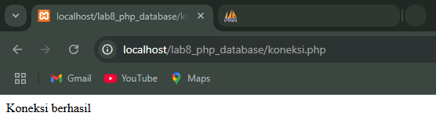
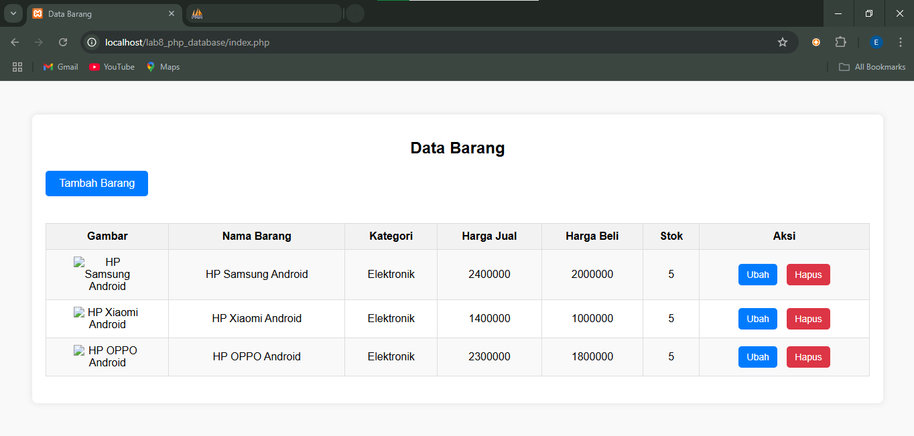
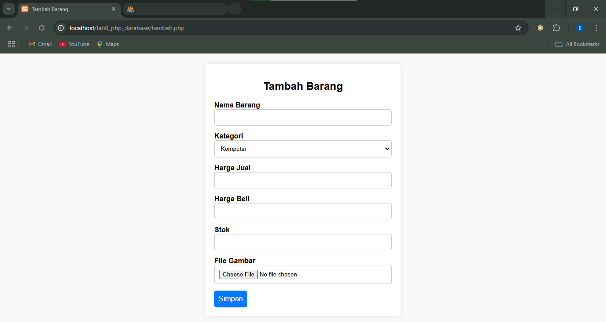
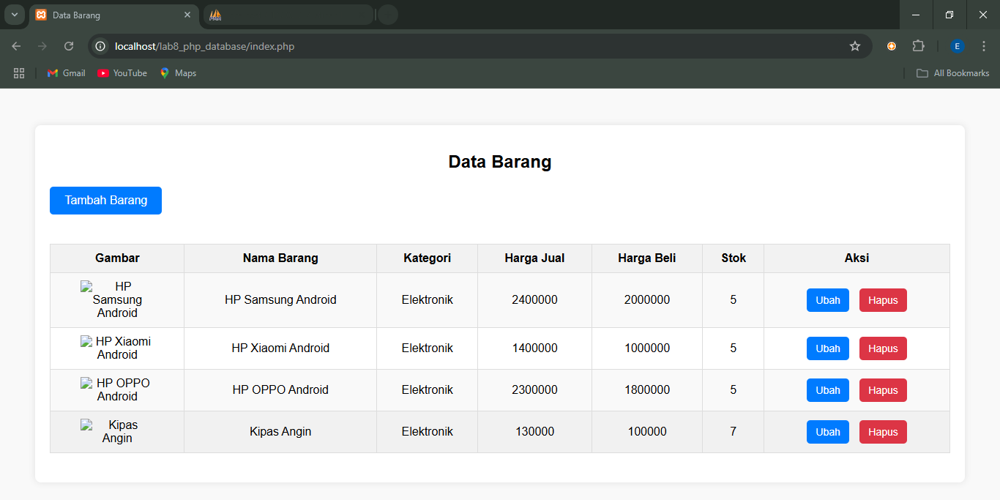
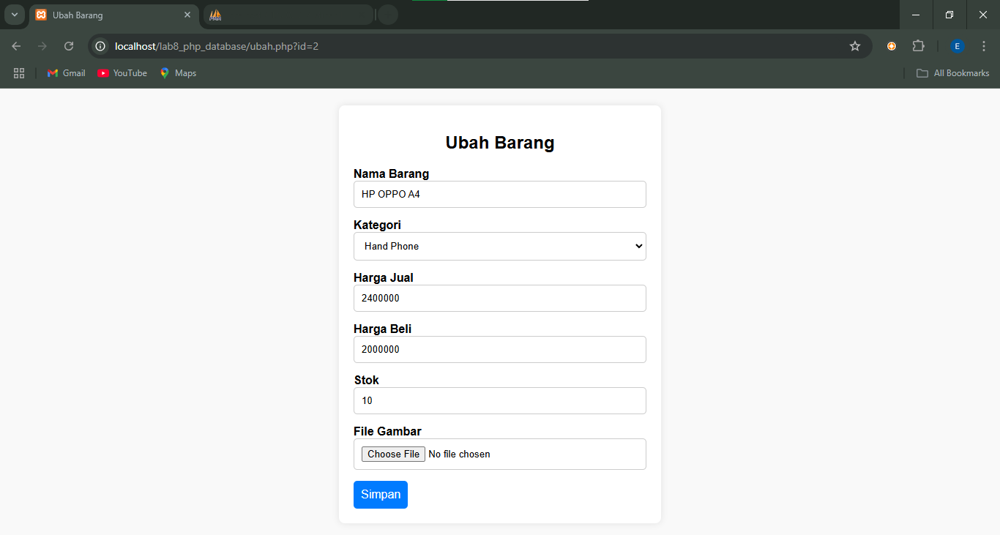
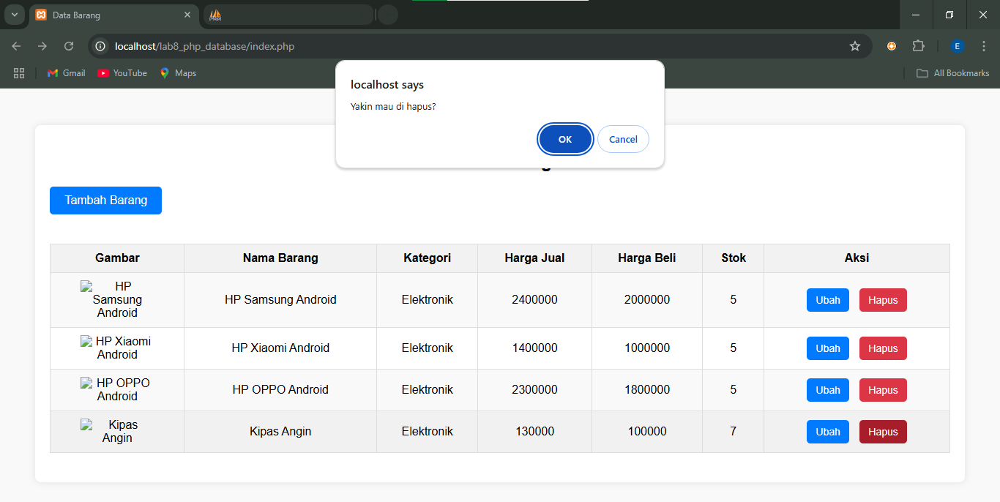
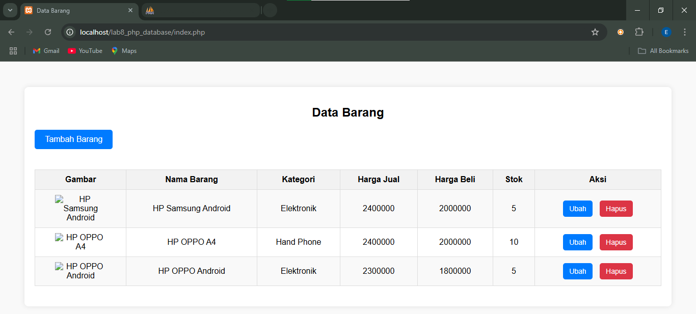

### Dzikry Eza Yusuf ( 312310731 ) TI.23.A2

### Perubahan sesuai urutan:

## 1. Cek koneksi terhubung atau tidak  
   > 
   
## 2. Tampilan awal  
   > 
   
## 3. Menambahkan barang  
   > 
   
## 4. Barang sudah ditambahkan  
   > 
   
## 5. Mengubah barang  
   > 
   
## 6. Barang sudah diubah  
   > 
   
## 7. Konfirmasi hapus barang  
   > 
   
## 8. Tampilan yang diperbaharui setelah hapus barang  
   > 
